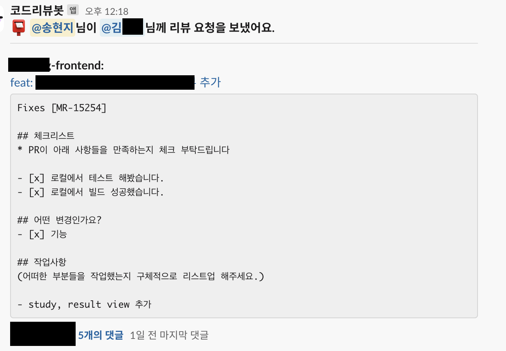

# PR Codereview Slack Notification Action

Integrate PR review activities into Slack with GitHub actions without a webhook server. All you need to do is add a github action workflow.

english is default.



## korean document

- [한국어 문서 보기](KOREAN.md)

## Features

1. PR review notifications will be sent to the channel you set when you opened the PR.

- "@reviewer has sent a review request to @reviewer"
- The repo, PR title (PR LINK), PR description, and LABEL information will be sent along with it.

2. if you add a reviewer, they will be mentioned in the PR opening message.

3. If you label the PR open with emergency, it will be accompanied by an "emergency" message.

- You can customize the label name.

4. When you comment, the comment is replied to the PR open message as a thread.

5. when you submit a PR review, you'll be commented on in the thread.

- comment: Reply as a comment.
- approve: Runs with LGTM message.
- request change: Runs with the request change message.

6. emoji when closing a PR

- close: x emoji (customizable).
- merge: white_check_mark emoji (customizable)

7. set language you want: it supports `english`, `korean` now

## How to use

1. you need to create slack bot and add the bot to the channel.

you also need to add the permissions to slack bot like `channels:history`, `chat:write`, `chat:write.public`, `groups:history`, `reactions:write` in `OAuth & Permissions`

2. create a pr-slack-notifiy.yml document inside `.github/workflows`

```yml
name: PR Slack Notification

on:
  pull_request:
    types: [opened, review_requested, closed]
  issue_comment:
    types: [created]
  pull_request_review:
    types: [submitted]

jobs:
  notify:
    runs-on: ubuntu-latest
    steps:
      - uses: actions/checkout@v2
      - name: Notify Slack
        uses: roseline124/codereview-action
        with:
          github_token: ${{ secrets.CODEREVIEWBOT_GITHUB_TOKEN }}
          slack_token: ${{ secrets.SLACK_TOKEN }}
          slack_channel: <SLACK_CHANNEL_ID>
          slack_workspace: <SLACK_WORKSPACE_NAME>
```

3. create a `reviewers.yml` file in the root of your project. Please make sure to follow this format.

```yml
reviewers:
  - githubName: roseline124
    slackId: U07712R6TGS
    name: hyunjisong
  - githubName: roseline125
    slackId: U07712R6TGS
    name: leemonglyong
  - githubName: roseline126
    slackId: U07712R6TGS
    name: hongkildong
```

You can customize the file path with the `reviewers_file` input.

```yml
name: PR Slack Notification

on:
  pull_request:
    types: [opened, review_requested, closed]
  issue_comment:
    types: [created]
  pull_request_review:
    types: [submitted]

jobs:
  notify:
    runs-on: ubuntu-latest
    steps:
      - uses: actions/checkout@v2
      - name: Notify Slack
        uses: roseline124/codereview-action
        with:
          github_token: ${{ secrets.CODEREVIEWBOT_GITHUB_TOKEN }}
          slack_token: ${{ secrets.SLACK_TOKEN }}
          slack_channel: <SLACK_CHANNEL_ID>
          slack_workspace: <SLACK_WORKSPACE_NAME>
          reviewers_file: <CUSTOM_FILE_PATH>
```

4. about inputs

| Input Name             | Description                                                                           | required | Default Value    |
| ---------------------- | ------------------------------------------------------------------------------------- | -------- | ---------------- |
| github_token           | add your github token                                                                 | true     | X                |
| slack_token            | slack api > OAuth & Permissions > Bot User OAuth Token                                | true     | X                |
| slack_channel          | you can get channel id from slack channel link                                        | true     | X                |
| slack_workspace        | get this input from <workspace_name>.slack.com                                        | true     | X                |
| reviewers_file         | custom reviewers.yml file path                                                        | false    | reviewers.yml    |
| slack_merge_emoji_name | merge emoji to attach to slack pr message                                             | false    | white_check_mark |
| slack_close_emoji_name | close emoji to attach to slack pr message                                             | false    | x                |
| emergency_label_name   | emergency label name. if this label exists, emergency message will be showed in slack | false    | emergency        |
| language               | set language you (ex. `en`, `ko`)want                                                 | false    | en               |

## test action

1. test action

- `act pull_request` (you need to install act)

2. if you use colima,

- `sudo ln -s /Users/{username}/.colima/default/docker.sock /var/run/docker.sock`

3. set event like this

- pr open event: `act pull_request --eventpath event-open.json`

## release

1. make changes

- `pnpm build`
- commit & push

2. if you push to

- `feature` branch: it release alpha tag (use alpha tag when testing)
- `main` branch: it release version tag & bump up the version
